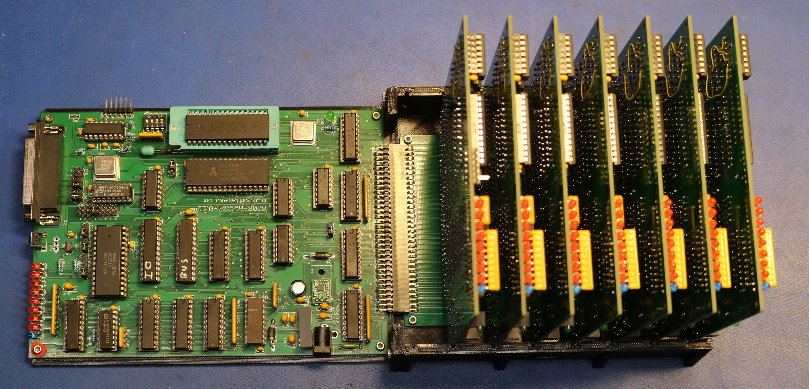
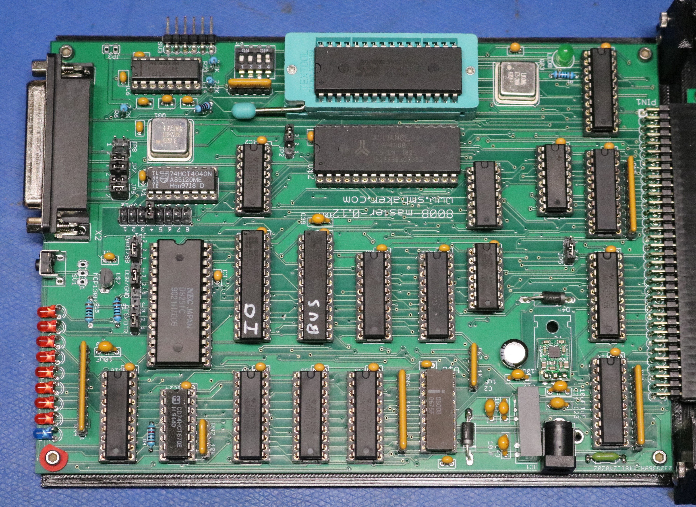
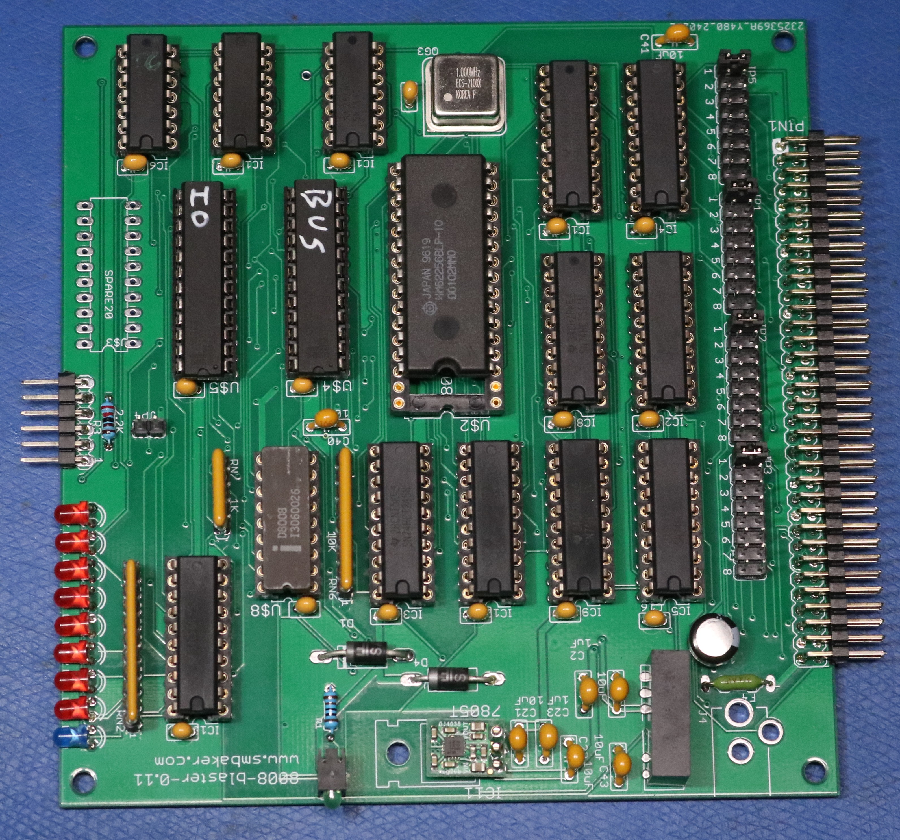

# Scott's 8008 Supercomputer

Scott Baker, https://www.smbaker.com/

This repository contains files that support my eight CPU 8008 computer project,
informally called my "8008 Supercomputer" or the "MasterBlaster Computer".

The computer is divided into two Boards

* Master. Serves as a controller. Contains RAM and ROM and Serial IO.

  

* Blaster. Serves as a worker. Contains RAM only. Does not contain ROM or support Serial IO.

  

Up to 8 Blasters can be used with one Master.

A shared memory approach is used where Master can take control of Blasters memory,
both to provide the binary program for Blaster to execute, as well as provide data input
to Blaster, and retrieving data output from Blaster.

Obviously, Blaster and Master cannot both use Blaster's shared RAM at the same time. Master
should only use it while Blaster is halted. This leads to a pattern where Blaster halts
at the end of each iteration, Master performs some memory operations to read results and
setup the next iteration, and then Master sends an interrupt to wake up Blaster.

# Schematics

Find them in the schematics/ directory

# Gerbers

Not here yet, but soon after I fix the next revision...

# Code

The code for this is contained in my H8-8008 project, which can be found at the following
repository:

* https://github.com/sbelectronics/h8/tree/master/h8-8008
